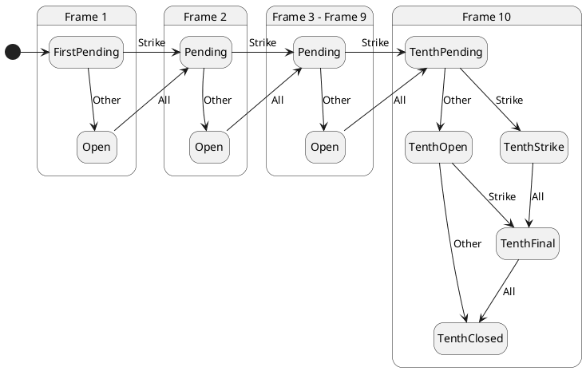

# The `Frame` types

The `frame` attribute contains a single `Frame` object that represents the
current, cumulative state of the game. Every roll results in a new `Frame`
object, even if the game remains in the same frame. The frame number is
incremented, and the game score accumulates within the `Frame` object.

There is one type that represents the initial state of the game, before any
rolls are made. Two other types represent the remaining states, through frame 9.
Because frame 10 is a special case, there are five types that represent its
state.

The following diagram shows the state transitions among the `Frame` types.

